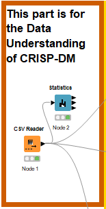
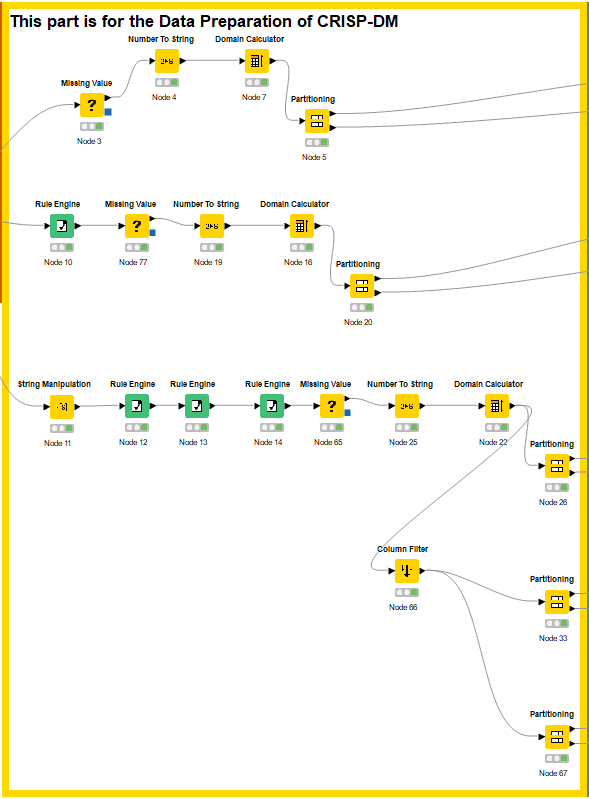
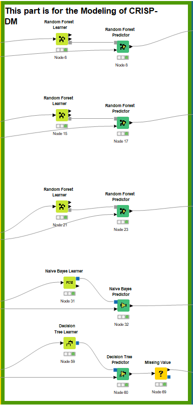
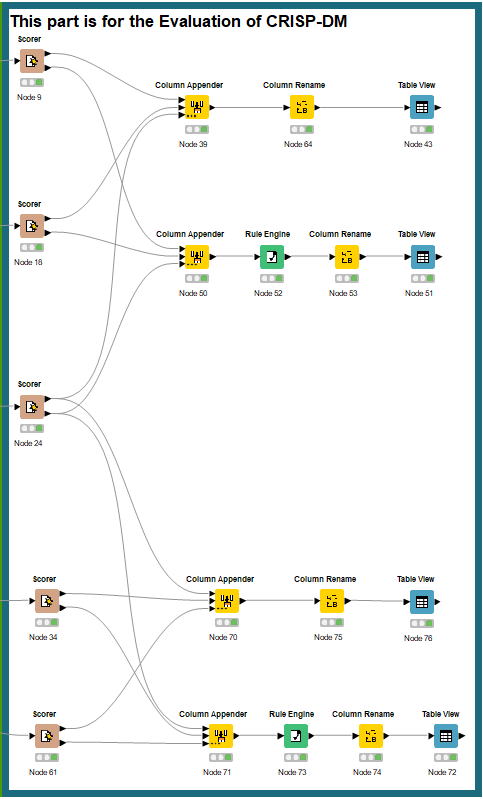
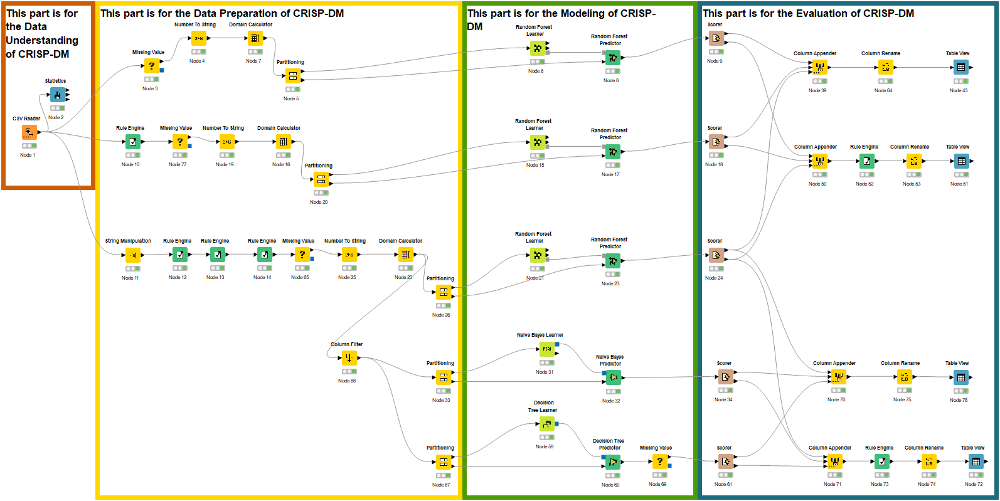

# Codeless-AI-ML-2022-Project

## Overview
Understanding the concept of the CRISP-DM model then clarifying which part of the project is in which part of the CRISP-DM model, and making 3 modeling of AI/ML using KNIME platform then comparing which model is most suitable to this data set (Titanic) by checking the which one got the most accurate. This repository will consist of
- KNIME_project_ai_titanic.knwf | For the KNIME workflow

## Tools
- KNIME

## Nodes being used in KNIME.
- CSV Reader
- Statistics
- Missing Value
- Number to String
- Domain Calculator
- Partitioning
- Rule Engine
- String Manipulation
- Column Filter
- Random Forest Learner
- Random Forest Predictor
- Naive Bayes Learner
- Naive Bayes Predictor
- Decision Tree Learner
- Decision Tree Predictor
- Scorer
- Column Rename
- Table View

## Data understanding of CRISP-DM 
Import data by CSV Reader node, then make it easier to see using the Statistics node.
<p float="left">
  
</p>

##  Data Preparation of CRISP-DM
Add the missing data of the columns because will need it for the condition to predict later on using the Missing Value node, then use the Number To String node for changing the numeric of data to string because to make predictions it is better to use string but not always necessary for this project it is needed so that in the Learner part it will not get any error. Next, due to the cause that adding the missing values, it needs to also add a Domain Calculator node for the Learner to work properly, and inside it change the Restrict number of possible values to 90-120. Next, use the Partitioning node to separate the data that use for learning and the data that use for checking the result of learning which is the prediction. Next, use the Random Forest Learner node to teach AI or ML for prediction. Then, the Random Forest Predictor node receives the data from the route of the Random Forest Learner node, and another one receives the data from the route of the Partitioning node. Lastly, use the Scorer node to show the result of all such as correct classified, wrong classified, accuracy, etc. Probably get the accuracy of prediction around 75%.

Next, to increase the accuracy of data use the Rule Engine node put between the CSV Reader node and the Missing Value noded for the expression to define the age range use this
```
$Age$ < 3 => "Infant"
$Age$ < 12 => "Child"
$Age$ < 20  => "Teenager"
$Age$ < 55 => "Adult"
$Age$ < 90 => "Senior"
TRUE => "Other" 
```
Now probably get the accuracy of prediction around 78%.

Again, to increase the accuracy of data use the string Manipulation node for the config to define the age range base of 4 first characters of the individual name, in expression put this

`
substr($Name$, indexOfChars($Name$, "," )+2 , 4 )
`

Then add the new Rule Engine node put after the string Manipulation but before the previous Rule Engine node in the expression put this
```
$First4Titles$ IN ("Mrs.","Mr. ", "Dr. ", "Don.", "Rev.", "Mme.", "Jonk", "the ", "Capt", "Mlle", "Col.", "Sir.", "Lady", "Majo", "Ms. ") => "Adult"
$First4Titles$ IN ("Miss","Mast") => "Child"
```

<p float="left">
  
</p>

##  Modeling of CRISP-DM
<p float="left">
  
</p>

##  Evaluation of CRISP-DM
<p float="left">
  
</p>

## Whole Process in KNIME
<p float="left">
  
</p>

# Author
- Lubnan Samae

# Project Resources
- https://towardsdatascience.com/a-beginners-guide-to-kaggle-s-titanic-problem-3193cb56f6ca // Explanation resource
- https://www.kaggle.com/competitions/titanic/ // Data-set resource
- https://www.youtube.com/watch?v=OOgRIwrwJQY // Tutorial resource